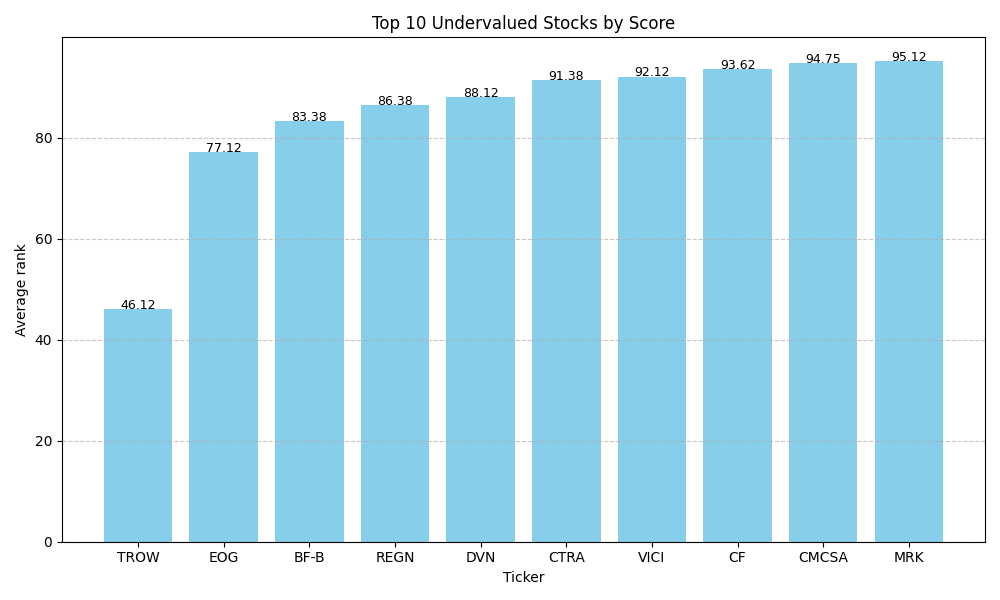

# SP500-Analyzer
Python project that analyzes all S&amp;P 500 companies and ranks undervalued stocks by combining drawdown analysis with key financial fundamentals. It automatically retrieves data, builds a ranking, highlights the best opportunities, and provides visual insights for systematic stock selection.

# S&P 500 Undervalued Stock Analyzer  

## Project Overview  
This project analyzes all **S&P 500 companies** and automatically generates a **ranking of undervalued stocks** based on both **technical** and **fundamental** factors.  

The main investment idea is:  
- Select companies with a **large current drawdown** (price significantly below its historical peak).  
- Filter only those with **strong fundamentals** (low P/E, solid profitability, good financial health).  

The assumption is that **fundamentally healthy companies that are currently trading far below their highs** are likely to recover and move back toward their peaks.  

This ranking can be used as a systematic way to identify potential investment opportunities.  

---

## Methodology  

1. **Data Collection**  
   - Download S&P 500 constituents from GitHub (CSV).  
   - Fetch daily closing prices from **Yahoo Finance** (via `yfinance`).  

2. **Technical Screening**  
   - Calculate the **global peak** and the **current drawdown** for each stock.  
   - Rank stocks by how far they are from their all-time high.  

3. **Fundamental Screening**  
   - Collect fundamental indicators (via `yfinance` API):  
     - P/E Ratio (TTM)  
     - P/B Ratio  
     - Debt-to-Equity  
     - Return on Equity (ROE)  
     - Dividend Yield  
     - Current Ratio  
     - Profit Margin  
   - Remove stocks with missing or extreme outlier values.  

4. **Scoring System**  
   - Normalize all indicators (min-max scaling).  
   - Combine them into a **composite score** (technical + fundamentals).  
   - Rank all companies based on the final average score.  

5. **Output**  
   - Export a **final report** with scores and ranks for all companies.  
   - Generate **Top 10 Undervalued Stocks** list.  
   - Produce visualization (bar plot of the top 10 scores).  

---

## Example Results  

**Top 10 stocks to buy (sample run):**

| Rank | Ticker | Total Score |
|------|--------|-------------|
| 1    | AAPL   | 0.87 |
| 2    | JPM    | 0.84 |
| 3    | NKE    | 0.82 |
| ...  | ...    | ... |

**Visualization – Top 10 Scores**  
  

---

## Technologies Used  
- **Python 3.13**  
- `pandas`, `numpy` – data analysis  
- `yfinance`, `yahooquery` – financial data retrieval  
- `matplotlib`, `seaborn` – visualization  

---

## Repository Structure  
│
├── sp500_analyzer.py #main script
├── plots/ #generated plots
├── requirements.txt #dependencies
└── README.md #project description

